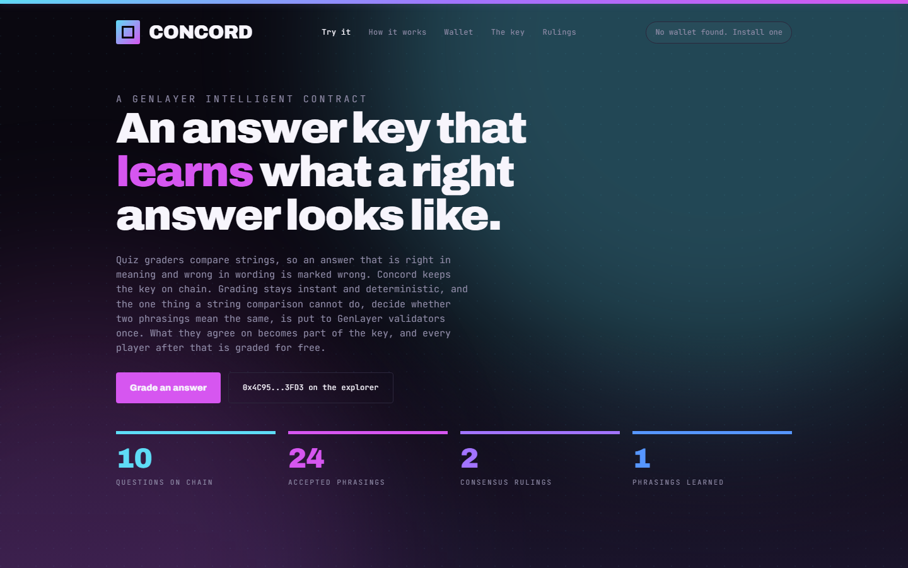

# Concord

**A quiz answer key held on chain, that learns what a right answer looks like.**

Live app: **https://0xyuura.github.io/concord/** (also on Vercel, see below)
Intelligent Contract: [`0x4C95B77f8D6CF7F3EC412aAaB6EFed5b92343FD3`](https://explorer-bradbury.genlayer.com/address/0x4C95B77f8D6CF7F3EC412aAaB6EFed5b92343FD3) on GenLayer Testnet Bradbury



---

## The problem

Short answer quizzes grade by comparing strings. The list of accepted spellings
is a guess someone made once, before anyone had played. A player who writes
"delegated proof-of-stake" when the list happens to carry only "dpos" is marked
wrong, and has no recourse. The grader is not wrong about the string. It is
wrong about the meaning, and a string comparison cannot tell the difference.

The obvious fix, putting a model in the grading path, breaks the thing it is
trying to fix. Grading has to be instant.

## What Concord does

It splits the problem in two and puts each half where it belongs.

**The fast path is deterministic and needs no model.** The answer is normalised
and matched against the phrasings already stored for that question, with a one
character typo tolerance. The client holds the same phrasings and runs the same
comparison, so a player gets a verdict immediately and no page ever waits on a
chain.

**The slow path is consensus, and it runs once per phrasing.** A player whose
answer was not covered can put it to the validators: does this mean the same
thing as the canonical answer, for this question? Each validator judges
independently and they must agree.

**A yes appends the phrasing to the key in contract storage.** The model is paid
for by the first person who ever writes it that way. Every player after that is
graded from state, instantly and for free. The answer key learns, and the only
thing that can teach it is a consensus round anybody can audit.

## How consensus is used

There is exactly one nondeterministic entry point, `rule`. Everything else is
ordinary deterministic code.

The judgement returns **one boolean** and nothing else. Validators rerun it and
compare that boolean. The model's prose reason is carried for humans and is
never compared, because two honest validators will never write the same
sentence and comparing prose would reject every honest peer forever.

A boolean is the narrowest thing that can be asked, which is the point. Honest
validators agree on clear cases, and a genuinely borderline phrasing makes them
disagree, which rotates the leader and ultimately refuses the write. That is the
correct outcome: a phrasing independent validators cannot both call correct has
no business being frozen into a shared answer key.

Three things the contract refuses without spending a model call at all:

| Refusal | Why |
| --- | --- |
| `ALREADY_ACCEPTED` | the deterministic path already covers it. Re-running consensus on a settled case would let a later round contradict an earlier one, and the key would stop being a record of anything |
| `ALREADY_RULED` | this exact phrasing has been judged before, either way |
| `KEY_FULL` | a key that grows without bound is a key nobody audits |

Errors are classified. Deterministic failures carry `[EXPECTED]` and must match
exactly between leader and validator. A malformed model response carries
`[LLM_ERROR]` and makes validators disagree, forcing a rotation. Notably an
unreadable verdict is **not** read as "no": silently treating a broken model
answer as a refusal would let a broken model quietly decide the outcome, and the
ruling would be stored as though it were real.

## The seed / ruling distinction

`add_question` seeds the spellings the author was willing to guess.
`retire_seed_form` can remove one, owner only, and it is deliberately unable to
touch anything consensus put there: if a ruling created the form, it stays.

A seed is a guess made before anyone played, and a guess can be wrong. A ruling
is a decision independent validators reached. A key the owner can rewrite is not
a record of anything.

That method exists because it was needed within an hour of the first
deployment. A shell coerced an empty argument to the string `"0"`, and `"0"`
became an accepted answer to a question about a programming language. The
deployment now live was seeded clean, and the escape hatch stayed.

## Where the boundary sits

| Owner | Responsibility |
| --- | --- |
| Frontend | the console, instant grading against the cached key, wallet connection, everything visual |
| Contract | the answer key, the consensus judgement on novel phrasings, and the permanent record of what was ruled and by whom |

The contract decides nothing about who won a game. It decides what counts as
the same answer, which is the part that needs to be shared, durable, and
auditable.

## Client and contract must agree

`src/lib/answerkey.ts` mirrors `normalize`, `editDistance` and `matchesForm`
from `contracts/answer_key.py`. If they drift, the app tells someone their
answer was accepted when no ruling exists for it.

The guarantee is pinned from both sides: `tests/test_deterministic.py` and
`src/lib/answerkey.test.ts` assert **the same table of cases** against the same
expected output, so editing one without the other turns a suite red instead of
reaching a player.

## Verified on chain

Both paths were exercised against the live contract before this was written.

| Step | Result |
| --- | --- |
| `grade(q5, "the optimistic democracy")` before | `unknown` |
| `rule(q5, "the optimistic democracy")` | `ACCEPTED` / `AGREE` / `FINISHED_WITH_RETURN`, verdict **true**, reason *"It is the same concept with an added definite article."* |
| `forms(q5)` after | `["optimistic democracy", "the optimistic democracy"]` |
| `grade(q5, "the optimistic democracy")` after | `correct`, deterministic, no model |
| `rule(q10, "proof of stake")` | verdict **false**, reason *"Proof of Stake is a broader category that contains DPoS but is not the same specific consensus mechanism."* |
| `forms(q10)` after | unchanged, and `grade` now returns `ruled_incorrect` |

The refusal is the more interesting of the two. The model was asked a narrow
question and gave the conservative answer the prompt asks for, and the key did
not widen to swallow a near miss.

## What the wallet is actually for

Reading asks nothing of you. The key, every ruling, and the reasoning behind
each one are public state on a public chain, so the page loads them with a
client that has no account attached and never prompts.

A wallet is asked for at one moment: sending a phrasing to the validators,
because that writes to the contract and somebody has to pay for the round. The
app therefore tells you, before you press anything, whether that moment can
succeed:

| State | What the page does |
| --- | --- |
| No injected wallet | says so plainly, explains that everything else still works, links to one |
| Wallet present, not connected | offers to connect, and says connecting unlocks nothing you cannot already see |
| Connected, wrong network | the chip turns red, and the send button is replaced by a switch button that adds Bradbury if the wallet has never seen it |
| Connected, no GEN | the balance turns red and the send button is replaced by a link to the faucet |
| Connected, funded, on Bradbury | the send button, and only then |

**Finding the wallet is the part that was wrong.** Reading `window.ethereum`
once, during the first render, misses two very ordinary cases: an extension that
injects a moment after first paint, and a wallet that follows **EIP-6963** and
announces itself on an event rather than squatting on a global. Either one left
the page insisting there was no wallet on a machine that plainly had one.

Discovery is now a subscription, not a question asked once. It listens for
`eip6963:announceProvider`, asks for announcements itself, still accepts a bare
`window.ethereum`, and covers the first second of the page with
`ethereum#initialized` plus a short poll that stops on its own. When more than
one wallet answers, you choose; when exactly one does, there is no dialog,
because a chooser with a single option is a click for nothing.

It also survives you changing your mind elsewhere. `accountsChanged` and
`chainChanged` are both watched, so switching account or network in another tab
updates the page instead of leaving a button that cannot possibly work.

The panel lists every ruling this address has paid for, matched against the
`asked_by` the contract stored with each one. That is read back from chain
state, not from anything this browser remembers.

## Motion

Built on **Motion for React** (`motion/react`, the library formerly published as
Framer Motion). Durations and easings live in `src/lib/motionTokens.ts` so that
thirty animations read as one system rather than thirty opinions.

Motion here carries information or it does not ship:

- The rail across the top says how far through a long page you are.
- One underline travels between nav items rather than five fading in place, and
  one pill slides between question tabs. The travel is what says these are a
  single control and you are somewhere inside it.
- Verdicts swap through `AnimatePresence`, so a changed answer reads as a new
  judgement rather than as text quietly rewriting itself.
- The counters count because they are live readings from the contract rather
  than printed numbers, and they land exactly on the value rather than on an
  eased approximation of it.
- The ambient light behind the page takes the colour of the question you are
  working on. That is the one large soft light in the design, and it is there
  because it reports state. Three drifting coloured blobs would not have.

Everything has a `prefers-reduced-motion` path, and every one of those paths
lands on the finished state. That matters more than it sounds: a reveal that is
skipped rather than completed would leave the page blank for exactly the people
who asked for less movement.

## Layout

```
contracts/answer_key.py        the Intelligent Contract
tests/test_deterministic.py    41 tests over every function that votes
tests/_stub.py                 minimal SDK stub so the contract imports under CPython
src/lib/answerkey.ts           the client mirror of the grading functions
src/lib/answerkey.test.ts      20 tests, sharing the contract's own case table
src/lib/chain.ts               genlayer-js wiring, reads without a wallet
src/lib/wallet.ts              wallet discovery, account, network, balance
src/lib/useWallet.ts           one hook holding the whole wallet state machine
src/lib/wallet.test.ts         6 tests over the pure formatting the UI decides on
src/lib/motion.ts              counters, scrollspy, sticky threshold, pointer light
src/lib/motionTokens.ts        durations and easings, so the motion reads as one system
src/components/WalletButton.tsx  the masthead control and its four states
src/components/WalletPicker.tsx  the chooser, for when several wallets are installed
src/App.tsx                    the app
docs/seed.py                   one off script that seeded the question set
```

## Running it

```bash
npm install
npm run dev          # http://localhost:5210
npm test             # 26 client tests

python -m unittest discover -s tests    # 41 contract tests
genvm-lint check contracts/answer_key.py
```

Reads need no wallet. Sending a phrasing to the validators needs an injected
wallet on Bradbury with a little GEN for gas.

## Honest limitations

- **The judgement is only as good as the model behind it.** Consensus proves
  that independent validators reached the same verdict from the same text. It
  does not prove the verdict is what a teacher would have said. Every ruling is
  stored with its reason so a human can check cheaply.
- **A borderline phrasing simply fails.** Validators disagree, the leader
  rotates, and the transaction does not land. That is intended, but it reads to
  a user as "nothing happened", and the app can only say the round did not
  settle.
- **The typo tolerance is one edit and only on forms of four characters or
  more.** Without that floor "den" would be graded as "gen". A two character
  slip on a long answer still has to go to consensus.
- **The key is capped at 40 phrasings per question.** A question that needs more
  than that is probably asking for a sentence, not a short answer.
- **Bradbury is intermittent.** Seeding this question set took retries, one
  `compile` style round came back `LEADER_TIMEOUT`, and the node rate limits
  transactions under load.
- **The feed costs one extra view call per row.** `recent_rulings` returns the
  verdict and the reason but not the asker, while `get_ruling` returns all
  three for a single row, so the client fetches the attribution per row. Both
  read the same stored record and nothing is invented client side. Widening the
  batch serialiser would have meant redeploying, which would have thrown away
  the live ruling history and left the source in this repo no longer matching
  the contract at the address above. Keeping those two identical was worth more
  than saving the calls.
